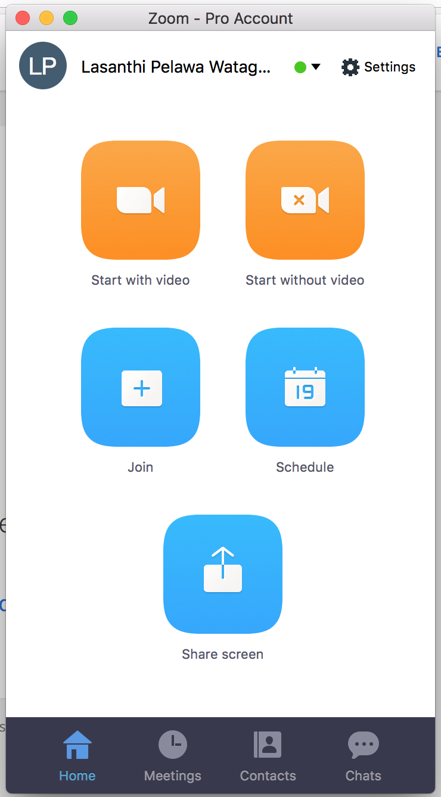
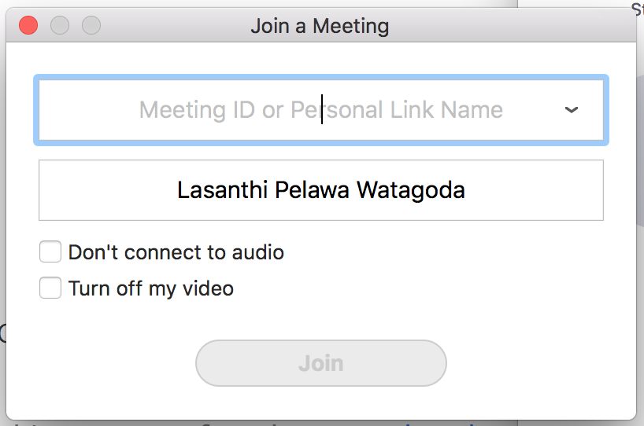
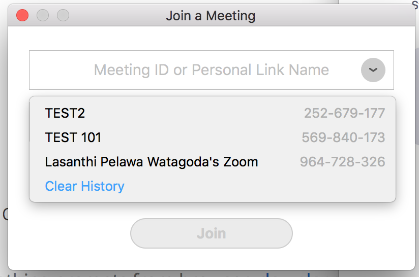

Note: This page is still under construction.

## How to Start?
1. Click on the relevent tutoring session's link in the 'Online Tutoring Schedule' below.
2. "Allow" zoom.us to open.
3. If you are a first time zoom user, you may need to install zoom in this step.
4. Click "Join".

  

5. Use the dropdown menu to select YOUR tutoring session.

  
   

## Online Tutoring Schedule

1. [TEST 101](https://appstate.zoom.us/j/569840173)(Tuesday 7 pm---9 pm) ---  Turor: Alex Martin

2. MATH 1810 (Sunday 7 pm---9 pm) ---  Turor: John Smith

3. STAT 2810 (Monday 7 pm---9 pm) ---  Turor: Tom Cruz

***