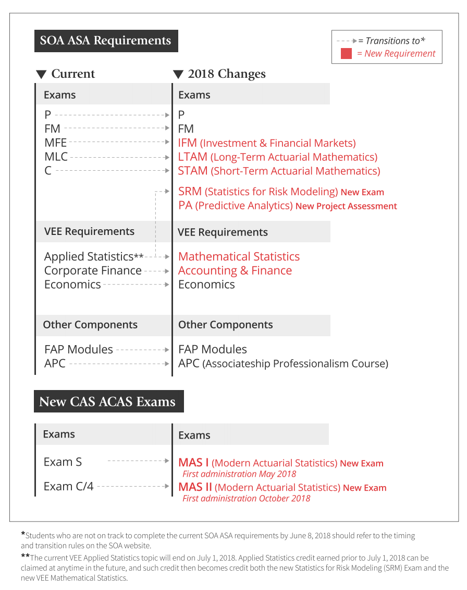

<style>
body {
  font-size: 16px;
  line-height: 1.7;
  color: #2b3440;
}

.main-container {
  max-width: 1180px !important;
}

h1, h2, h3, h4 {
  color: #1f3a5f;
}

a {
  color: #2f5597;
}

.page-hero {
  padding: 44px 42px;
  margin: 18px 0 34px 0;
  border-radius: 16px;
  background: linear-gradient(135deg, #f5f8fc 0%, #eaf1f8 100%);
  border: 1px solid #dce5ef;
  box-shadow: 0 8px 28px rgba(31,58,95,.08);
}

.page-hero h1 {
  margin: 0 0 8px 0;
  font-size: 2.5em;
}

.page-hero p {
  margin: 0;
  color: #52677d;
  font-size: 1.08em;
  max-width: 850px;
}

.section-title {
  margin-top: 40px;
  margin-bottom: 20px;
  padding-bottom: 8px;
  border-bottom: 3px solid #d9e2f3;
}

.quick-grid {
  display: grid;
  grid-template-columns: repeat(3, 1fr);
  gap: 18px;
  margin: 20px 0 30px 0;
}

.quick-card {
  background: white;
  border: 1px solid #dde5ed;
  border-top: 5px solid #2f5597;
  border-radius: 10px;
  padding: 20px 21px;
  box-shadow: 0 4px 14px rgba(31,58,95,.06);
}

.quick-card h3 {
  margin-top: 0;
  margin-bottom: 10px;
}

.office-card {
  border-top-color: #4f8a5b;
}

.teaching-card {
  border-top-color: #3182bd;
}

.meeting-card {
  border-top-color: #7952b3;
}

.action-button {
  display: inline-block;
  margin-top: 8px;
  padding: 9px 14px;
  border-radius: 6px;
  background: #2f5597;
  color: white !important;
  text-decoration: none !important;
  font-weight: 600;
}

.action-button:hover {
  background: #1f3a5f;
}

.action-button.green {
  background: #4f8a5b;
}

.action-button.green:hover {
  background: #3d7047;
}

.schedule-wrap {
  overflow-x: auto;
  margin: 20px 0 32px 0;
}

.weekly-schedule {
  width: 100%;
  border-collapse: separate;
  border-spacing: 6px;
  table-layout: fixed;
}

.weekly-schedule th {
  background: #eef3f8;
  color: #1f3a5f;
  padding: 11px 8px;
  text-align: center;
  border-radius: 6px;
}

.weekly-schedule td {
  padding: 12px 8px;
  vertical-align: middle;
  text-align: center;
  border-radius: 7px;
  border: 1px solid #e1e6eb;
  background: #fafbfd;
}

.weekly-schedule .time {
  background: #f4f6f8;
  color: #52606d;
  font-weight: 700;
  white-space: nowrap;
}

.research {
  background: #f6f1fc !important;
  border-color: #dfd2f1 !important;
  color: #62418c;
  font-weight: 600;
}

.office {
  background: #eef8ef !important;
  border-color: #cfe6d2 !important;
  color: #397046;
  font-weight: 700;
}

.class {
  background: #eef6fd !important;
  border-color: #cadeef !important;
  color: #285b83;
  font-weight: 700;
}

.prep {
  background: #fff8e8 !important;
  border-color: #f1dfaa !important;
  color: #84630f;
  font-weight: 600;
}

.meeting {
  background: #f3effa !important;
  border-color: #ddd2ee !important;
  color: #68478e;
  font-weight: 700;
}

.lunch {
  background: #f6f7f8 !important;
  color: #6c757d;
  font-weight: 600;
}

.schedule-note {
  color: #6f7e8d;
  font-size: .92em;
  margin-top: -12px;
  margin-bottom: 25px;
}

.office-location {
  display: grid;
  grid-template-columns: 1.05fr 1fr;
  gap: 20px;
  margin: 20px 0 32px 0;
}

.location-card,
.map-card {
  background: #f8fafc;
  border: 1px solid #dde5ed;
  border-radius: 10px;
  padding: 22px;
}

.location-card {
  border-left: 6px solid #4f8a5b;
}

.map-card {
  border-left: 6px solid #3182bd;
}

.location-card h3,
.map-card h3 {
  margin-top: 0;
}

.map-frame {
  width: 100%;
  height: 300px;
  border: 0;
  border-radius: 8px;
}

.resource-grid {
  display: grid;
  grid-template-columns: repeat(2, 1fr);
  gap: 18px;
  margin: 20px 0 32px 0;
}

.resource-card {
  background: white;
  border: 1px solid #dde5ed;
  border-radius: 10px;
  padding: 20px 21px;
}

.resource-card h3 {
  margin-top: 0;
}

.resource-card li {
  margin-bottom: 8px;
}

.policy-box {
  background: #f8fafc;
  border-left: 6px solid #6c757d;
  padding: 18px 21px;
  border-radius: 8px;
  margin: 20px 0;
}

.quote {
  color: #647381;
  font-style: italic;
  margin-top: 10px;
}

@media (max-width: 900px) {
  .quick-grid {
    grid-template-columns: 1fr;
  }

  .office-location,
  .resource-grid {
    grid-template-columns: 1fr;
  }

  .page-hero {
    padding: 30px 24px;
  }

  .page-hero h1 {
    font-size: 2em;
  }
}
</style>

<div class="page-hero">

# For Students

Office hours, weekly availability, course information, campus resources, and links for current students.

<div class="quote">“Professors value them, students sample them, and technology expands them.” — <em>The Harvard Gazette</em></div>

</div>

## Fall 2026 at a Glance {.section-title}

<div class="quick-grid">

<div class="quick-card office-card">

### Office Hours

**Tuesday & Thursday**  
**9:15 – 10:45 AM**

Edwin Duncan Hall

No appointment is necessary during regularly scheduled office hours.

<a class="action-button green" href="https://lasanthi.youcanbook.me/" target="_blank">Book an Appointment →</a>

</div>

<div class="quick-card teaching-card">

### Teaching

**STT 3852 — Statistical Learning II**

Tuesday & Thursday  
**11:00 AM – 12:15 PM**

</div>

<div class="quick-card meeting-card">

### Department Meetings

Most Wednesdays  
**3:00 – 5:00 PM**

Department meetings and departmental service activities are typically scheduled during this block.

</div>

</div>

## Typical Weekly Schedule {.section-title}

<div class="schedule-wrap">

<table class="weekly-schedule">
<thead>
<tr>
<th>Time</th>
<th>Monday</th>
<th>Tuesday</th>
<th>Wednesday</th>
<th>Thursday</th>
<th>Friday</th>
</tr>
</thead>
<tbody>

<tr>
<td class="time">8:00–9:15</td>
<td class="research">Research</td>
<td class="prep">Class Prep</td>
<td class="research">Research</td>
<td class="prep">Class Prep</td>
<td class="research">Research</td>
</tr>

<tr>
<td class="time">9:15–10:45</td>
<td class="research">Research / Meetings</td>
<td class="office">Office Hours</td>
<td class="research">Research</td>
<td class="office">Office Hours</td>
<td class="research">Research / Meetings</td>
</tr>

<tr>
<td class="time">11:00–12:15</td>
<td class="research">Research</td>
<td class="class">STT 3852</td>
<td class="research">Research / Writing</td>
<td class="class">STT 3852</td>
<td class="research">Research</td>
</tr>

<tr>
<td class="time">12:15–1:15</td>
<td class="lunch">Lunch</td>
<td class="lunch">Lunch</td>
<td class="lunch">Lunch</td>
<td class="lunch">Lunch</td>
<td class="lunch">Lunch</td>
</tr>

<tr>
<td class="time">1:15–3:00</td>
<td class="prep">Prep / Grading</td>
<td class="prep">Prep / Grading</td>
<td class="research">Research / Meetings</td>
<td class="prep">Prep / Grading</td>
<td class="research">Research / Writing</td>
</tr>

<tr>
<td class="time">3:00–5:00</td>
<td class="research">Research / Meetings</td>
<td class="research">Research / Meetings</td>
<td class="meeting">Department Meeting*</td>
<td class="research">Research / Meetings</td>
<td class="research">Research / Writing</td>
</tr>

</tbody>
</table>

</div>

<div class="schedule-note">

*This is a typical weekly schedule and may change due to university meetings, research collaborations, student appointments, deadlines, or other professional responsibilities. Most Wednesday afternoons from 3:00–5:00 PM are reserved for department meetings.

</div>

## Office Location {.section-title}

<div class="office-location">

<div class="location-card">

### Edwin Duncan Hall

My office is located in the newly renovated **Edwin Duncan Hall** on Appalachian State University's Boone campus.

**Building address:**  
730 Rivers Street  
Boone, NC 28608

The renovated building reopens for Fall 2026, with the main entrance located near the northwest end of the building by the Peacock Parking Lot.

<a class="action-button green" href="https://maps.appstate.edu/" target="_blank">Open App State Campus Map →</a>

</div>

<div class="map-card">

### Find Edwin Duncan Hall

<iframe
  class="map-frame"
  src="https://www.openstreetmap.org/export/embed.html?bbox=-81.6905%2C36.2130%2C-81.6795%2C36.2205&layer=mapnik&marker=36.2168%2C-81.6850">
</iframe>

<a class="action-button" href="https://maps.appstate.edu/" target="_blank">View Interactive Campus Map →</a>

</div>

</div>

## Meeting With Me {.section-title}

<div class="policy-box">

### Office Hours & Appointments

No appointment is necessary during regularly scheduled office hours.

If the scheduled office-hour times do not work for you, individual meetings may be arranged by appointment. Please use the online scheduler or contact me by email.

<a class="action-button" href="https://lasanthi.youcanbook.me/" target="_blank">Schedule a Meeting →</a>

</div>

## Important Academic Resources {.section-title}

<div class="resource-grid">

<div class="resource-card">

### Dates & Registration

- [Academic Calendar](https://registrar.appstate.edu/calendars-schedules/academic-calendar)
- [Exam Schedule](https://registrar.appstate.edu/calendars-schedules/exam-schedule-0)
- [Registration Access Times](https://registrar.appstate.edu/students/registration-classes/early-registration-access)

</div>

<div class="resource-card">

### Writing & Academic Support

- [University Writing Center](https://writingcenter.appstate.edu/)
- [Office of Disability Resources](https://odr.appstate.edu/)

</div>

<div class="resource-card">

### Courses & Computing

- [Teaching](teaching.html)
- [Computing Resources](resources.html)

</div>

<div class="resource-card">

### Actuarial Science

- [App State Actuarial Science](https://mathscias.appstate.edu/)

</div>

</div>

## Accessibility & University Support {.section-title}

<div class="policy-box">

Appalachian State University provides accommodations and support for students with qualifying disabilities. Students who may need accommodations should contact the University's **Office of Disability Resources** and follow the University's current procedures.

[Visit the Office of Disability Resources →](https://odr.appstate.edu/)

</div>

---


<!--
---
title: "For Students"
output: 
  html_document:
    toc: true
    toc_float:
      collapsed: false
---


## Office Hours <i class="fa fa-clock-o"></i>

<font size="5"> <span style="color:purple;"> Professors value them, students sample them, and technology expands them</span> </font>    <font size="1"> The Harvard Gazette </font> 


Office hours arrangement: No appointment necessary during regularly scheduled hours. Individual meetings are scheduled by appointment via email. Use [book now](https://lasanthi.youcanbook.me/)  to book several individual meetings.


```{r, echo = FALSE}
df <- data.frame(Time = c( "09:30-10:45", "11:00-12:15", "12:30-01:45","02:00-03:00"), Monday = c("Research", "Research", "LunchBreak","Prep"), Tuesday = c( "STT 3851", "Lunch Break", "STT3250", "Office Hours"), Wednesday = c("Prep", "STT3250", "Office Hours",""), Thursday = c("STT 3851", "Lunch Break", "STT3250", "Office Hours"))
knitr::kable(df, align = c("c","c","c","c","c"))
```


<center>
<figure>
<figcaption> Walker Hall </figcaption>

</figure>
</center>

```{r include = FALSE}
library(leaflet)
library(dplyr)
```

Use the leaflet map below to find Walker Hall. 

```{r, echo = FALSE}

leaflet() %>%
  setView(lng=-81.684954, lat=36.216777, zoom = 16) %>% 
  addTiles() %>%
  addMarkers(lng=-81.684954, lat=36.216777, popup="Walker Hall") 
```

## Important Dates and Times

- [Academic calendar](https://registrar.appstate.edu/calendars-schedules/academic-calendar) <i class="fa fa-calendar"></i>
- [Exam schedule](https://registrar.appstate.edu/calendars-schedules/exam-schedule-0)
- [Registration Access Times](https://registrar.appstate.edu/students/registration-classes/early-registration-access)

## Writing Resources

Please visit [The University Writing Center](http://writingcenter.appstate.edu/) for resources to help you with your papers and other writing pursuits.


## Disability Services and Test Proctoring 


"Appalachian State University is committed to making reasonable accommodations for individuals with documented qualifying disabilities in accordance with the Americans with Disabilities Act of 1990, and Section 504 of the Rehabilitation Act of 1973. If you have a disability and may need reasonable accommodations in order to have equal access to the University's courses, programs and activities, please contact the Office of Disability Services (828.262.3056 or <http://ods.appstate.edu>).Once registration is complete, individuals will meet with ODS staff to discuss eligibility and appropriate accommodations."

## Courses I Teach

* Click the [Teaching Tab](teaching.html)

## Computing Resources

* Click the [Resources Tab](resources.html)

## Actuarial Science

* [AppState Actuarial Science website](https://mathscias.appstate.edu/)

* Summary of 2018 Curriculum Changes & Exam Transitions

<center>
<figure>

</figure>
</center>

* * *