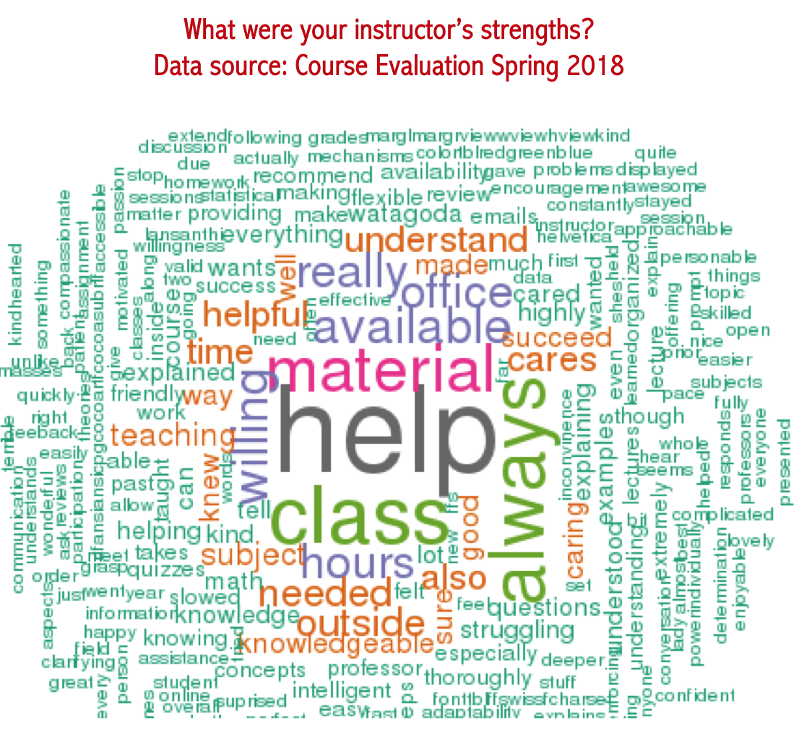

<i class="glyphicon glyphicon-star"></i> This page will serve as a directory for courses from Fall 2011 forward. <i class="glyphicon glyphicon-thumbs-up"></i>

## Classes I teach this semester (FALL 2018)

* STT 3830  - Statistical Methods II 
* [STT 2810 - Introduction to Statistics](https://www.pearsonmylabandmastering.com/northamerica/)

* [AsULearn](https://asulearn.appstate.edu/)
* [Miscellaneous Statistics](https://alanarnholt.github.io/GeneralStatistics/)

<figure>

</figure>

## Classes I teach  in Spring 2019 
* [STAT 3851 | Statistical Data Analysis II](https://lasanthi-asu.github.io/STT3851ClassRepo/index.html) 

## Classes I taught in the past
* STAT 3851 | Statistical Data Analysis II (Spring 2018)
* STAT 3830 | Statistical Methods II  (Fall 2017)
* STAT 2810 | Introduction to Statistics (Fall 2017)
* MATH 282 | Introduction to Statistics  (Spring 2015 / Spring 2016)
* MATH 111 | Precalculus   (Fall 2015 )
* MATH 140 | A Short Course in Calculus  (Summer 2014)
* MATH 139 | Finite Mathematics  (Fall 2014)
* MATH 109 | Trigonometry and Analytic Geometry (Fall 2016)
* MATH 108 | College Algebra  (Fall 2013/Spring 2014)

* MATH 101 | Introduction to Contemporary Mathematics (Paper Base)  (Spring 2013)
* MATH 113 | Introduction to Contemporary Mathematics (Spring 2012/Fall 2012)

### Online classes:
* MATH 282 | Introduction to Statistics (Summer 2017)
* MATH 108 | College Algebra  (Summer 2015)
* MATH 139 | Finite Mathematics  (Summer 2017)

* * *