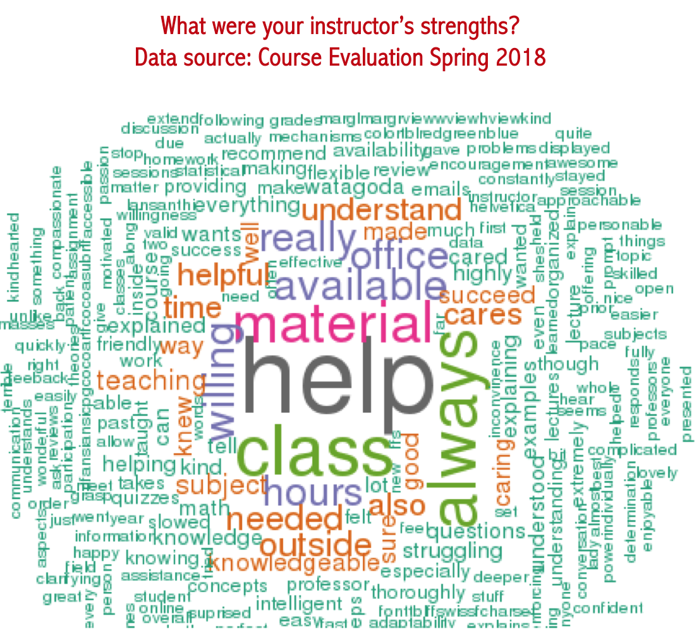

# Teaching

This page highlights courses taught, instructional experience, online teaching, and course development from **2011 to the present**.

## Current & Featured Courses {.section-title}

STT 3851

### Statistical Data Analysis II

A course focused on statistical modeling, data analysis, computing, and interpretation.

<a class="course-button" href="https://lasanthiwatagoda.github.io/STT3852/">Course Website →</a>

STT 2810

### Introduction to Statistics

An introductory statistics course emphasizing statistical reasoning, data analysis, and interpretation.

<a class="course-button" href="https://www.pearsonmylabandmastering.com/northamerica/">Course Platform →</a>

## Teaching Experience {.section-title}

### Appalachian State University

Primary Instructor · 2017–Present

<strong>STT 3852</strong> Statistical Learning II

<strong>STT 5830</strong> Linear Regression Models

<strong>STT 4830</strong> Linear Regression Models

<strong>STT 4831 / MAT 4040</strong> Linear Regression Models (Capstone)

<strong>STT 4880</strong> Mathematical Statistics

<strong>STT 3250</strong> Fundamentals of Probability

<strong>STT 3851</strong> Statistical Data Analysis II

<strong>STT 3830</strong> Statistical Methods II

<strong>STT 2820</strong> Reasoning with Statistics

<strong>STT 2810</strong> Introduction to Statistics

### Southern Illinois University

Primary Instructor · 2011–2017

<strong>MATH 139</strong> Finite Mathematics

<strong>MATH 108</strong> College Algebra

<strong>MATH 109</strong> Trigonometry & Analytic Geometry

<strong>MATH 140</strong> A Short Course in Calculus

<strong>MATH 111</strong> Precalculus for Engineering Students

### Southern Illinois University

Substitute Instructor · Fall 2016

<strong>MATH 405</strong> Intermediate Differential Equations

<strong>MATH 150</strong> Calculus I

<strong>MATH 250</strong> Calculus II

<strong>MATH 251</strong> Calculus III

<strong>MATH 106</strong> College Algebra Enhanced

### Recitation & Laboratory Instruction

2010–2013

Introduction to Contemporary Mathematics

Mathematical Tools and Computational Applications

Applicable Mathematics

Introduction to Geometrical Transformations

Numerical Analysis

Quantum Mechanics I

Laboratory instruction in Maple, MATLAB, and C++

## Course Development & Online Teaching {.section-title}

### Course Development

- **Statistical Learning II (STT 3852)** — 2025
- **Introduction to Statistics (Online)** — Summer/Fall 2016
- **Exam P Preparation Course Manual** — Summer 2019

### Online Courses

- MATH 282 — Introduction to Statistics, Summer 2017
- MATH 108 — College Algebra, Summer 2015
- MATH 139 — Finite Mathematics, Summer 2017

### Teaching Resources

- [AsULearn](https://asulearn.appstate.edu/)
- [Miscellaneous Statistics](https://alanarnholt.github.io/GeneralStatistics/)

## Selected Course History {.section-title}

The table below preserves selected semester-specific course history from the earlier version of this website. The teaching-experience section above provides the broader list of courses taught.

<table class="archive-table">
<thead>
<tr>
<th>Course</th>
<th>Title</th>
<th>Selected Terms</th>
</tr>
</thead>
<tbody>
<tr><td><strong>STT 3250</strong></td><td>Introduction to Probability</td><td>Fall 2019; Spring 2021</td></tr>
<tr><td><strong>STT 3851</strong></td><td>Statistical Data Analysis II</td><td>Spring 2018, 2019, 2021, 2026</td></tr>
<tr><td><strong>STT 4830</strong></td><td>Linear Regression Models</td><td>Fall 2020</td></tr>
<tr><td><strong>STT 4880</strong></td><td>Mathematical Statistics</td><td>Spring 2020</td></tr>
<tr><td><strong>MAT 4510</strong></td><td>Senior Honors Thesis</td><td>Spring 2019</td></tr>
<tr><td><strong>STT 3830</strong></td><td>Statistical Methods II</td><td>Fall 2017, 2018</td></tr>
<tr><td><strong>STT 2810</strong></td><td>Introduction to Statistics</td><td>Fall 2017–2020; Spring 2018–2019; Spring 2026</td></tr>
<tr><td><strong>MATH 282</strong></td><td>Introduction to Statistics</td><td>Spring 2015, 2016; Summer 2017</td></tr>
<tr><td><strong>MATH 111</strong></td><td>Precalculus</td><td>Fall 2015</td></tr>
<tr><td><strong>MATH 140</strong></td><td>A Short Course in Calculus</td><td>Summer 2014</td></tr>
<tr><td><strong>MATH 139</strong></td><td>Finite Mathematics</td><td>Fall 2014; Summer 2017</td></tr>
<tr><td><strong>MATH 109</strong></td><td>Trigonometry and Analytic Geometry</td><td>Fall 2016</td></tr>
<tr><td><strong>MATH 108</strong></td><td>College Algebra</td><td>Fall 2013; Spring 2014; Summer 2015</td></tr>
<tr><td><strong>MATH 101</strong></td><td>Introduction to Contemporary Mathematics</td><td>Spring 2013</td></tr>
<tr><td><strong>MATH 113</strong></td><td>Introduction to Contemporary Mathematics</td><td>Spring 2012; Fall 2012</td></tr>
</tbody>
</table>

---

<!--
---
title: "Teaching"
output: html_document
---

<i class="glyphicon glyphicon-star"></i> This page will serve as a directory for courses from Fall 2011 forward. <i class="glyphicon glyphicon-thumbs-up"></i>

### Spring 2026

*  [STT 3851 | Statistical Data Analysis II](https://lasanthiwatagoda.github.io/STT3851/)

* [STT 2810 | Introduction to Statistics](https://www.pearsonmylabandmastering.com/northamerica/)

<!--

### Fall 2025

[STT 3852 | Statistical Learning II](https://lasanthiwatagoda.github.io/STT3852/)

### Spring 2025

* [STT 3851 | Statistical Data Analysis II](https://lasanthiwatagoda.github.io/STT3851/)

### Fall 2023

* [STT 3851 | Statistical Data Analysis II](https://lasanthiwatagoda.github.io/STT3851/)

### Fall 2022

* [STT 4830 |Linear Regression Models](https://lasanthiwatagoda.github.io/STT4830ClassRepo/index.html)

* [STT 4831 | Linear Regression Models Capstone Capstone](https://lasanthiwatagoda.github.io/STT4830ClassRepo/index.html)

* [STT 5831 | Linear Regression Models: Gradute Section](https://lasanthiwatagoda.github.io/STT4830ClassRepo/index.html)

### Fall 2021

* [STT 4830 |Linear Regression Models](https://lasanthiwatagoda.github.io/STT4830ClassRepo/index.html)

* [STT 4831 | Linear Regression Models Capstone](https://lasanthiwatagoda.github.io/STT4830ClassRepo/index.html)

* [STT 2820 | Introduction to Statistics](https://www.pearsonmylabandmastering.com/northamerica/)

### Fall 2020

* [STT 4830 |Linear Regression Models](https://lasanthiwatagoda.github.io/STT4830ClassRepo/index.html)

* [STT 4831 | Linear Regression Models Capstone](https://lasanthiwatagoda.github.io/STT4830ClassRepo/index.html)

* [STT 2810 | Introduction to Statistics](https://www.pearsonmylabandmastering.com/northamerica/)

***
<!--
### Spring 2021

* [STT 3250  |Introduction to Probability](https://lasanthiwatagoda.github.io/STT3250Sring2021/index.html)

* [STT 3851 | Statistical Data Analysis II](https://lasanthi-asu.github.io/STT3851ClassRepo/index.html) 

***

<!--## 
* [STT 4880 | Mathematical Statistics](https://lasanthiwatagoda.github.io/STT4880SP2020ClassRepo/index.html) 

* [STT 2810 | Introduction to Statistics](https://www.pearsonmylabandmastering.com/northamerica/)
-->
<!--## Fall 2019 

* [STT 3250 | Probability](https://lasanthiwatagoda.github.io/STT3250Fall2019ClassRepo/index.html) 

* [STT 2810 | Introduction to Statistics](https://www.pearsonmylabandmastering.com/northamerica/)-->

<!-- ## Spring 2019 

* [STT 3851 | Statistical Data Analysis II](https://lasanthi-asu.github.io/STT3851ClassRepo/index.html) 

* [STT 2810 | Introduction to Statistics](https://www.pearsonmylabandmastering.com/northamerica/)-->

<!-- ##  Fall 2018

* [STT 3830  - Statistical Methods II](STT3830Fall2017.html) 
* [STT 2810 - Introduction to Statistics](https://www.pearsonmylabandmastering.com/northamerica/) -->

<!--
<figure>

</figure>

***

### Recent Courses

* STT 3250  |Introduction to Probability (Spring 2021)

* STT 3851 | Statistical Data Analysis II (Spring 2021)

* STT4830  | Linear Regression Models (Fall 2020)

* STT4880  | Mathematical Statistics (Spring 2020)

* STT 3250 | Introduction to Probability (Fall 2019)

* MAT 4510 | Senior Honors Thesis (Spring 2019)

* STT 3851 | Statistical Data Analysis II (Spring 2018,Spring 2019)

* STT 3830 | Statistical Methods II  (Fall 2017,Fall 2018)

* STT 2810 | Introduction to Statistics (Fall 2017, 2018, 2019, 2020/ Spring 2018, 2019)

* MATH 282 | Introduction to Statistics  (Spring 2015, 2016)

* MATH 111 | Precalculus   (Fall 2015)

* MATH 140 | A Short Course in Calculus  (Summer 2014)

* MATH 139 | Finite Mathematics  (Fall 2014)

* MATH 109 | Trigonometry and Analytic Geometry (Fall 2016)

* MATH 108 | College Algebra  (Fall 2013/ Spring 2014)

* MATH 101 | Introduction to Contemporary Mathematics (Paper Base)  (Spring 2013)

* MATH 113 | Introduction to Contemporary Mathematics (Spring 2012/Fall 2012)

### Online classes:

* MATH 282 | Introduction to Statistics (Summer 2017)

* MATH 108 | College Algebra  (Summer 2015)

* MATH 139 | Finite Mathematics  (Summer 2017)

* [AsULearn](https://asulearn.appstate.edu/)
* [Miscellaneous Statistics](https://alanarnholt.github.io/GeneralStatistics/)

* * *
-->
